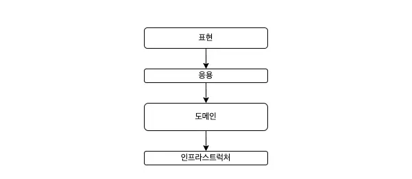
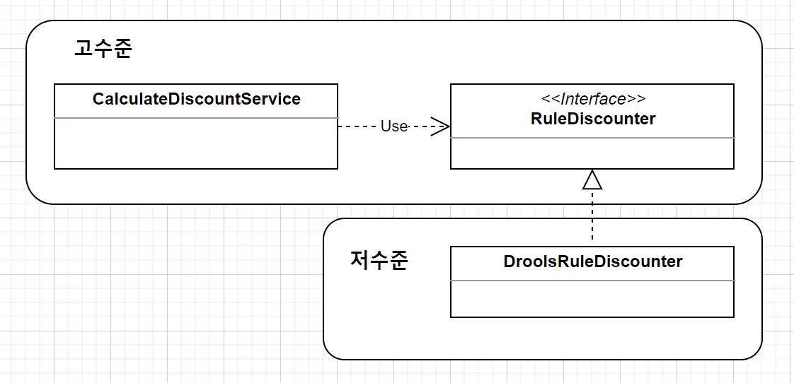
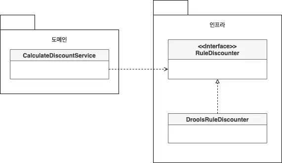
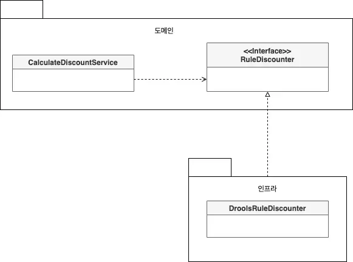
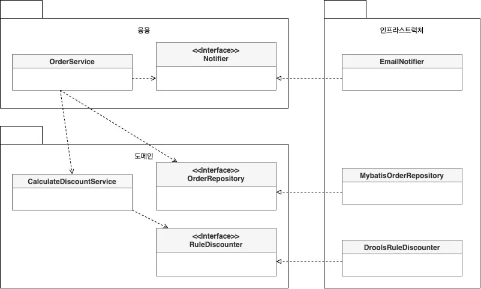

## 0. 목차

1. 머리말
2. 아키텍처의 네 가지 영역
3. 계층 구조 아키텍처와 문제점
4. 의존 역전 원칙 (DIP)
5. 실무 적용 사례
6. 요약

---

## 1. 머리말

> 이 문서는 사용자의 초안을 바탕으로 Gemini가 체계적으로 구조화하고 내용을 다듬어 작성했다.
>

---

## 2. 아키텍처의 네 가지 영역



아키텍처 설계 시 전형적으로 나타나는 네 가지 핵심 영역은 다음과 같다.

- **표현 영역 (Presentation Layer)**
    - 사용자의 요청을 받아 응용 영역에 전달한다.
    - 응용 영역의 처리 결과를 다시 사용자에게 보여주는 역할을 수행한다.
- **응용 영역 (Application Layer)**
    - 시스템이 사용자에게 제공해야 할 기능을 구현한다.
    - 기능 구현을 위해 도메인 영역의 모델을 사용한다.
    - 핵심 로직을 직접 수행하기보다는 도메인 모델에 로직 수행을 위임하는 역할을 한다.
- **도메인 영역 (Domain Layer)**
    - 도메인 모델을 구현하는 계층이다.
    - 도메인의 핵심 비즈니스 로직을 포함한다.
- **인프라스트럭처 영역 (Infrastructure Layer)**
    - 구현 기술에 대한 상세 내용을 다룬다.
    - RDBMS 연동, 메시지 큐 송수신, HTTP 요청, 메일 전송 등이 여기에 해당한다.
    - 논리적 개념보다는 실제 기술적 구현에 집중한다.

---

## 3. 계층 구조 아키텍처와 문제점

### 3.1 계층 구조의 특징

일반적으로 네 영역은 상위 계층이 하위 계층에 의존하는 구조로 구성된다.

- **구조적 유연성:** 도메인 복잡도에 따라 응용과 도메인을 분리하거나 하나의 계층으로 합치기도 한다.
- **의존 방향:** 원칙적으로 상위 계층에서 하위 계층으로만 의존하며, 하위 계층은 상위 계층을 알지 못한다.
- **엄격함의 정도:** 엄격한 계층 구조는 바로 아래 계층에만 의존하지만, 편의상 응용 계층이 인프라스트럭처 계층에 직접 의존하기도 한다.

### 3.2 인프라스트럭처 직접 의존 시 문제점

응용이나 도메인 계층이 상세 구현을 다루는 인프라스트럭처 계층에 직접 의존할 경우, 코드는 변경에 취약해진다.

아래는 할인 금액 계산을 위해 인프라스트럭처 영역의 `DroolsRuleEngine`을 직접 사용하는 예시다.

```kotlin
class DroolsRuleEngine(
    val kContainer: KieContainer = KieService.Factory.get()
        .getKieClasspathContainer(),
) {
    fun evaluate(sessionName: String, facts: List<*>) {
        val kSession = kContainer.newKieSession(sessionName)
        try {
            facts.forEach{ x -> kSession.insert(x) }
            kSession.fireAllRules()
        } finally {
            kSession.dispose()
        }
    }
}
```

```kotlin
class CalculateDiscountService(
    val ruleEngine: DroolsRuleEngine = DroolsRuleEngine()
) {
    fun calculateDiscount(orderLines: List<OrderLine>, customerId: String) {
        val customer = findCustomer(customerId)

        val money = MutableMoney(0)
        val facts = mutableListOf(customer, money)
        facts.addAll(orderLines)
        ruleEngine.evaluate("discountCalculation", facts)
        return money.toImmutableMoney()
    }

```

위 코드에서 `CalculateDiscountService`는 `DroolsRuleEngine`에 강하게 결합되어 있어 다음과 같은 문제가 발생한다.

1. **테스트의 어려움:** `DroolsRuleEngine`이 완벽하게 동작해야만 서비스 테스트가 가능하다.
2. **기능 확장의 어려움:** `Drools`의 세션 명이 변경되거나 데이터 타입이 바뀌면 응용 계층의 코드도 함께 수정해야 한다.

---

## 4. 의존 역전 원칙 (DIP)

### 4.1 고수준 모듈과 저수준 모듈

- **고수준 모듈:** 의미 있는 단일 기능(예: 가격 할인 계산)을 제공하는 모듈.
- **저수준 모듈:** 하위 기능을 실제로 구현한 것(예: JPA를 이용한 고객 정보 조회).

고수준 모듈이 저수준 모듈에 직접 의존하면 앞서 언급한 테스트 및 확장의 문제가 발생한다. 이를 해결하기 위해 **저수준 모듈이 고수준 모듈에 의존하도록 의존 관계를 역전**시켜야 하며, 이때 **인터페이스**를 활용한다.

### 4.2 DIP 적용 및 구현

`CalculateDiscountService`의 입장에서 중요한 것은 '룰을 적용해 할인 금액을 구한다'는 사실이며, 실제 구현 기술(`Drools`)은 중요하지 않다. 이를 추상화하면 다음과 같다.

```kotlin
class CalculateDiscountService(
    val ruleEngine: RuleDiscounter
) {

    fun calculateDiscount(orderLines: List<OrderLine>, customerId: String): Money {
        val customer = findCustomer(customerId)
        return ruleEngine.applyRules(customer, orderLines)
    }
}

interface RuleDiscounter {
    fun applyRules(customer: Customer, orderLines: List<OrderLine>): Money
}
```

이제 실제 구현 클래스는 인터페이스를 상속받아 구현한다.

```kotlin
class DroolsRuleDiscounter(
    val kContainer: KieContainer
): RuleDiscounter {
    override fun applyRules(customer: Customer, orderLines: List<OrderLine>): Money {
        // ... 실제 구현 내용
    }
}
```

이 과정을 통해 의존성 구조는 다음과 같이 변경된다.



### 4.3 DIP 적용의 이점

1. **구현 기술 교체의 용이성**
   로직 변경 시 서비스 내부 코드를 수정할 필요 없이 주입받는 구현체만 변경하면 된다.

    ```kotlin
    val ruleDiscounter = AnotherRuleDiscounter()
    val discountService = CalculateDiscountService(ruleDiscounter)
    ```

2. **테스트 용이성**
   인터페이스를 이용해 대역 객체(Stub, Mock)를 생성함으로써, 실제 구현체가 없어도 독립적인 테스트가 가능하다.

    ```kotlin
    @Test
    void test() {
        val stubRule = (customer, lines) -> null
        val calDiscountService = CalculateDiscountService(stubRule)
        // ...
    }
    ```


### 4.4 DIP 적용 시 주의사항

단순히 인터페이스를 추출한다고 해서 DIP가 완성되는 것은 아니다. 인터페이스는 **고수준 모듈의 관점**에서 도출되어야 한다.



**잘못된 적용 예:** 도메인 영역이 여전히 인프라스트럭처 영역에 의존하는 경우.



**올바른 적용 예:** 하위 기능을 추상화한 인터페이스가 고수준 모듈(도메인) 영역에 위치하는 경우.

### 4.5 DIP와 아키텍처 구조 변화

DIP를 적용하면 인프라스트럭처 영역이 응용 및 도메인 영역에 의존(상속)하는 구조가 형성된다.



결과적으로 도메인과 응용 영역에 영향을 주지 않으면서 구현 기술을 자유롭게 변경할 수 있는 유연한 아키텍처가 된다.

- 주문 시 이메일 알람 뿐만 아니라 카카오톡 알림을 보내야 한다면?
    - 응용 계층 코드 수정 없이 `Notifier`를 구현한 인프라스트럭처 영역의 `EmailNotifier` 구현체를 변경하면 된다.
- 데이터베이스 접근 시 Mybatis 대신 JPA를 사용하고 싶다면?
    - MybatisOrderRepository 대신 Jpa를 이용한 OrderRepository를 구현한 클래스를 인프라스트럭처 영역에 추가한다.

---

## 5. 실무 적용 사례

---

## 6. 요약

소프트웨어 아키텍처는 표현, 응용, 도메인, 인프라스트럭처의 4계층으로 구성되며, 일반적인 상위 계층 의존 구조는 구현 기술 변경 시 코드 수정이 전파되는 문제를 안고 있다. 이를 해결하기 위해 **의존 역전 원칙(DIP)**을 적용하여 고수준 모듈이 저수준 구현체가 아닌 인터페이스에 의존하도록 설계해야 한다. 올바른 DIP 적용은 **테스트 용이성**을 확보하고, 요구사항 변화에 따른 **기능 확장 및 기술 교체**를 유연하게 만든다.