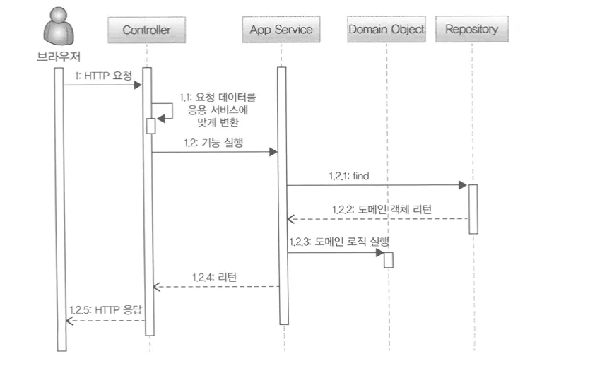
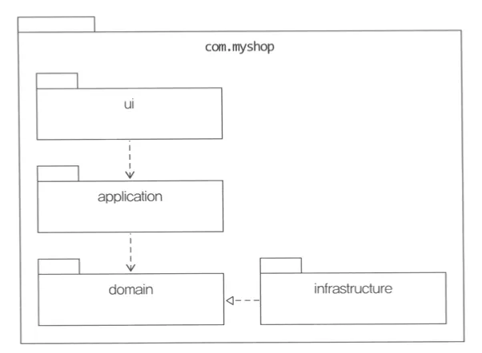
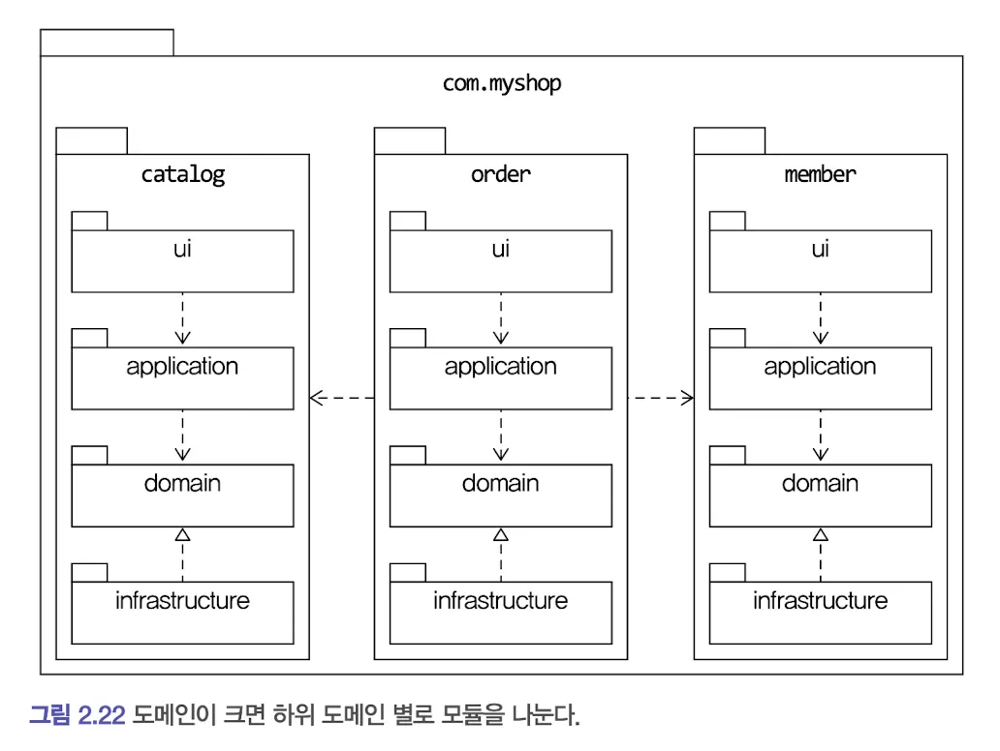
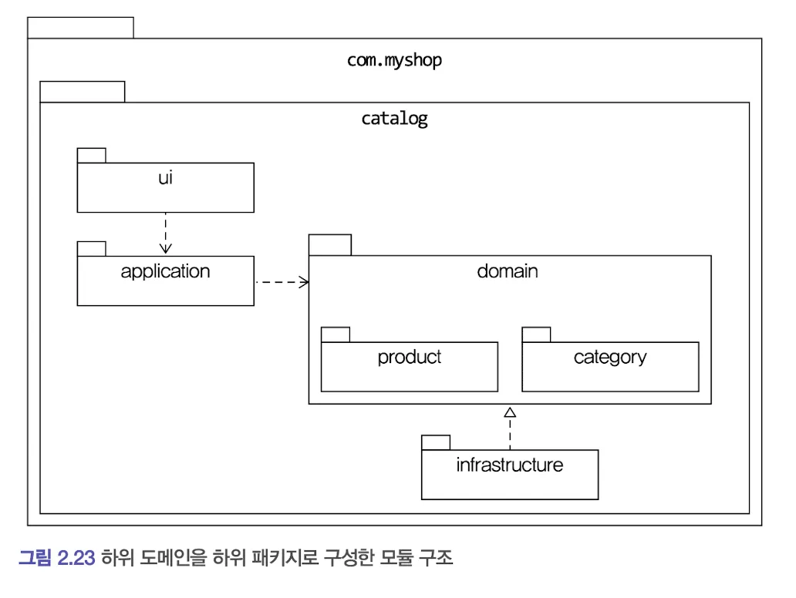

# 목차

1. **개요**
2. **도메인 영역의 주요 구성요소**
   2.1 엔티티(Entity)와 밸류(Value)
   2.2 애그리거트(Aggregate)
   2.3 리포지터리(Repository)
3. **아키텍처 및 처리 흐름**
   3.1 요청 처리 흐름
   3.2 인프라스트럭처의 역할
4. **모듈 구성 전략**
5. **실무 적용 사례**
6. **요약**

---

이 문서는 사용자의 초안을 바탕으로 Gemini가 체계적으로 구조화하고 내용을 다듬어 작성했다.

---

### 1. 개요

이 문서는 도메인 주도 설계(DDD) 아키텍처의 핵심 구성요소인 엔티티, 애그리거트, 리포지터리의 개념을 정리하고, 요청 처리 흐름과 모듈 구성 방식을 설명한다. 이를 통해 도메인 모델의 무결성을 유지하고 유연한 시스템을 구축하는 방법을 제시한다.

---

### 2. 도메인 영역의 주요 구성요소

#### 2.1 엔티티(Entity)와 밸류(Value)

데이터베이스(DB) 모델과 도메인 모델은 명확히 구분되어야 한다. 도메인 모델의 가장 큰 특징은 데이터와 함께 **기능**을 제공한다는 점이다.

* **도메인 엔티티의 특징:**
* 단순히 데이터를 담는 구조체가 아니라, 데이터와 관련된 기능을 함께 캡슐화한 객체다.
* **캡슐화:** 도메인 관점에서 기능을 구현함으로써 데이터가 임의로 변경되는 것을 방지한다.
* **예시:** 주문(Order) 엔티티는 주문 데이터뿐만 아니라 '배송지 주소 변경'과 같은 도메인 로직을 함께 포함한다.


* **밸류 타입(Value Type):**åç
* 두 개 이상의 데이터가 개념적으로 하나의 의미를 가질 때 이를 밸류 타입으로 표현하여 명확성을 높인다.


#### 2.2 애그리거트(Aggregate)

애그리거트는 복잡한 도메인 모델을 상위 수준에서 이해하고 관리하기 위한 개념이다.

* **정의:** 관련된 객체들을 하나로 묶은 군집이다.
* 예: **주문 애그리거트** = 주문(Order) + 배송지 정보 + 주문자 + 주문 목록 + 총 결제 금액


* **장점:**
* 개별 객체 단위가 아닌 군집 단위로 모델을 파악할 수 있어 전체 구조 이해에 도움이 된다.
* 애그리거트 간의 관계로 모델을 단순화하여 관리 효율성을 높인다.


* **루트 엔티티(Root Entity):**
* 애그리거트 군집을 관리하는 대표 엔티티다.
* **접근 제어:** 외부에서는 반드시 루트 엔티티를 통해서만 애그리거트 내부의 엔티티나 밸류 객체에 접근하거나 기능을 실행해야 한다.
* **무결성 보장:** 예를 들어, 주문 애그리거트의 루트인 `Order`를 거치지 않고 `ShippingInfo`를 직접 변경하는 것은 허용되지 않는다.


#### 2.3 리포지터리(Repository)

리포지터리는 도메인 객체를 보관하고 조회하는 물리적 저장소를 추상화한 개념이다.

* **역할:** 애그리거트 단위로 도메인 객체를 저장하거나 조회하는 기능을 제공한다.
* **구현:**
* **인터페이스:** 도메인 영역에 정의된 고수준 모듈(예: `OrderRepository`).
* **구현 클래스:** 인프라스트럭처 영역에 위치하며 실제 기술(JPA, MyBatis 등)을 사용해 구현된 저수준 모듈.


```kotlin
interface OrderRepository() {
	fun findbyId(id: Long): Order
}

```

* **응용 서비스와의 관계:**
* 응용 서비스는 의존성 주입(DI)을 통해 리포지터리 구현 객체를 사용한다.
* 리포지터리는 응용 서비스가 필요로 하는 메서드(저장, 식별자를 통한 조회 등)를 제공한다.
* 트랜잭션 관리는 리포지터리 구현 기술의 영향을 받는다.


---

### 3. 아키텍처 및 처리 흐름

#### 3.1 요청 처리 흐름

* **표현 영역 (Presentation Layer):**
* 사용자 데이터의 형식을 검증한다.
* 데이터에 문제가 없다면 응용 서비스가 요구하는 형식으로 변환하여 실행을 위임한다.


* **응용 서비스 (Application Service):**
* 도메인 모델을 이용하여 실제 기능을 수행한다.
* 리포지터리를 통해 필요한 도메인 객체를 가져오거나, 신규 객체를 생성하여 저장한다.


#### 3.2 인프라스트럭처의 역할

인프라스트럭처는 표현, 응용, 도메인 영역을 기술적으로 지원하는 계층이다.

* **주요 기능:** 영속성 처리(Persistence), 트랜잭션 관리, SMTP/REST 클라이언트 등 프레임워크 및 구현 기술을 제공한다.
* **유연한 설계 (DIP 적용):**
* 도메인/응용 영역에서 인프라 기능을 직접 사용하는 것보다, 인터페이스를 정의하고 인프라 영역에서 이를 구현하는 것이 테스트와 확장에 유리하다.


---

### 4. 모듈 구성 전략

아키텍처의 각 영역은 별도의 패키지로 분리하여 관리한다.

* **기본 구조:** 영역별로 패키지를 구성한다.

* **도메인별 분리:** 도메인의 크기가 커질 경우 하위 도메인별로 모듈을 나눈다.

* **애그리거트 기준 상세 분리:** 도메인 모듈 내부는 애그리거트를 기준으로 다시 패키지를 구성할 수 있다.
* 예: 카탈로그 도메인 하위에 `product`(상품)와 `category`(카테고리) 패키지를 둔다.


---
### 5. 실무 적용 사례

---

### 6. 요약

도메인 주도 설계에서 **엔티티**는 데이터와 기능을 캡슐화한 핵심 객체이며, **애그리거트**는 이러한 객체들의 데이터 무결성을 보장하는 군집 단위다. **리포지터리**는 도메인 객체의 영속성을 추상화하여 비즈니스 로직과 인프라 기술을 분리한다. 이를 통해 시스템은 유연한 모듈 구조를 갖추게 되며, 실무에서는 필요에 따라 구현 기술을 도메인 모델에 일부 결합하여 생산성을 높이는 전략을 취할 수 있다.